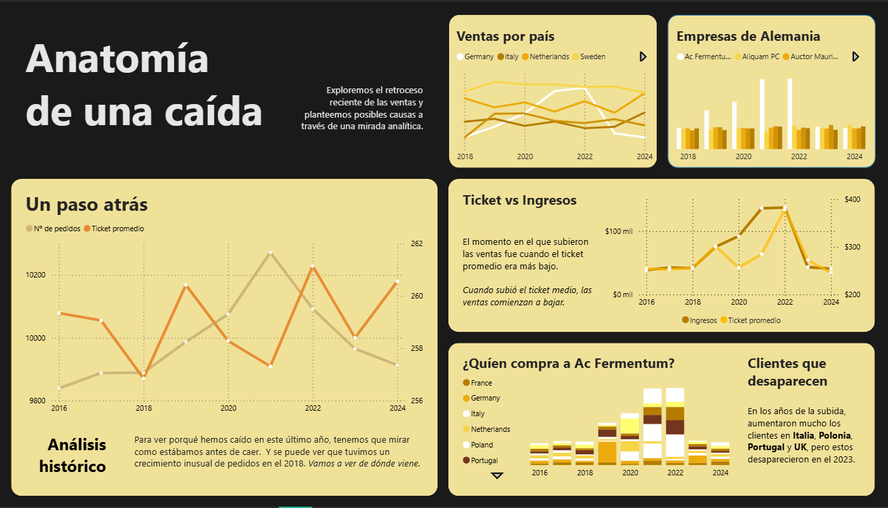

## 🚀 **Análisis Forense de Ventas e Identificación de Fuga de Clientes | Proyecto End-to-End con Power BI (ITAcademy)**

Este proyecto es un **análisis de diagnóstico y estrategia *End-to-End*** que abordó la caída de ventas en un comercio online. El análisis aplicó habilidades avanzadas de **Modelado de Datos** y **Diseño de Información** para descubrir la causa raíz cuantificable: la pérdida masiva de clientes en el mercado alemán.

-----

### 💡 **El Desafío (La Crisis Comercial y el Punto Ciego)**

La dirección observaba una baja generalizada en los ingresos sin conocer el origen. El sistema de *reporting* previo carecía de la capacidad de segmentación y modelado para aislar factores críticos como la fuga de clientes.

  * **El Problema:** Determinar si la caída de ventas era un problema general de producto o un problema de retención en un mercado específico, para dirigir una acción estratégica inmediata.

-----

### 📖 **La Historia del Dato (Narrativa del Analista)**

> "Este proyecto empezó con una simple pregunta: *¿Por qué están cayendo las ventas?* Al principio, la tendencia parecía generalizada. Sin embargo, al modelar la data con foco en la geografía y las interacciones del cliente, el dashboard comenzó a 'hablar'. El punto de inflexión fue la segmentación por continente, donde la luz de alerta se encendió sobre **Alemania**. El análisis de las series de tiempo y los recuentos de clientes reveló que el problema no era de rendimiento de producto, sino de una **fuga masiva en ese mercado clave**. Transformamos una vaga preocupación sobre 'ventas bajas' en el diagnóstico preciso de un problema de retención, proporcionando un *insight* que requería una intervención estratégica inmediata."

-----

### 🎯 **La Solución (Implementación Técnica y Descubrimiento)**

El proyecto se centró en la ingeniería de datos y el diseño para facilitar la exploración y el diagnóstico, sirviendo como una herramienta integral de *reporting* y análisis.

  * **Herramientas Clave:** Power BI Desktop (Modelado, DAX, Visualización) y Power Query (ETL/Limpieza).

#### 1\. Ingeniería y Modelado de Datos (Back-End)

  * **Modelo de Estrella Optimizado:** Se construyó un **Modelo de Estrella** robusto unificando las tablas de hechos (transacciones) y las dimensiones (clientes, productos, tiempo), incluyendo la creación de **tablas intermedias** para garantizar la integridad y la velocidad de las consultas.
  * **Limpieza de Datos Exhaustiva:** Implementación de **numerosos pasos de transformación** en Power Query (cambio de unidades, estandarización de formatos, manejo de inconsistencias) para garantizar la calidad y fiabilidad de los datos de origen.

#### 2\. Análisis Exploratorio Multi-Dimensional

El dashboard fue diseñado para una exploración exhaustiva antes del diagnóstico, permitiendo al usuario descartar hipótesis mediante:

  * **Análisis de Portafolio:** Visualización de **qué vendemos** (productos, categorías) y su rendimiento.
  * **Análisis Geográfico y Logístico:** Exploración de **dónde vendemos** y el flujo de ventas.
  * **Análisis Temporal y de Estacionalidad:** Identificación de patrones de compra por **continente** y periodo.
  * **Análisis de Canales:** Evaluación de la contribución de los canales digitales, incluyendo las **redes más usadas**.

#### 3\. El Descubrimiento Crítico

  * **Diagnóstico Preciso:** El análisis basado en el modelo reveló que la pérdida de clientes se concentraba en **Alemania**, y esta fuga de clientes representó el **4% del total de ventas** del comercio.

-----

### ✨ **Logros y Resultados (Valor y Perfil Profesional)**

El proyecto demuestra un perfil profesional que combina la precisión técnica con una entrega de valor clara.

  * **Impacto Cuantificable y Diagnóstico:** El análisis proporcionó un diagnóstico inmediato sobre la causa del problema, **cuantificando su impacto en el 4% de las ventas totales**, permitiendo enfocar los recursos hacia la retención de clientes en un mercado específico.
  * **Amplitud Analítica y Reporting Base:** El dashboard se consolidó como una **herramienta integral de *reporting*** que ofrece una visión completa de la estacionalidad, rendimiento de productos y eficacia de los canales digitales.
  * **Gobernanza y Calidad del Dato:** Se garantiza la fiabilidad del informe mediante la aplicación de **procesos rigurosos de limpieza y estandarización** en Power Query, asegurando que el informe sea una **Fuente Única de Verdad (SSOT)**.
  * **Visualización de Alto Impacto:** La presentación fue diseñada con una **alta atención al detalle gráfico (gracias al *background* de Diseñador Gráfico)**, empleando colores y jerarquías para guiar al usuario y **resaltar el segmento crítico**.

-----

## 📊 **Visualizaciones del Dashboard (Diseño de Información en Acción)**

El diseño gráfico se aplicó para transformar la data en un diagnóstico claro y visualmente intuitivo, demostrando la capacidad de comunicación de *insights*.

### Vista 1: Dashboard Principal (Vista Integral)



  * **Leyenda:** Demostración de la amplitud analítica, mostrando la visión general de ventas, estacionalidad y el impacto de las redes sociales, sirviendo como punto de partida para todas las exploraciones.

### Vista 2: El Descubrimiento Crítico


  * **Leyenda:** Gráfico que demuestra la caída en ventas de Alemania, validando el hallazgo crítico del proyecto.

### Vista 3: Clientes que desaparecen


  * **Leyenda:** Ilustra el uso de bloques blancos para visibilizar al gran cantidad de clientes de paises como Italia, Poland o Uk que desaparecieron.

-----

### ⏭️ **Próximos Pasos y Escalabilidad**

Este proyecto sienta las bases para futuras iniciativas de inteligencia de negocio, mostrando la visión estratégica del análisis:

  * **Monitoreo Activo:** Implementación de un sistema de alertas en Power BI Service para notificar inmediatamente sobre picos anormales en la tasa de abandono de clientes (Churn Rate).
  * **Análisis Predictivo:** Ampliación del modelo con datos externos o algoritmos para predecir qué clientes tienen mayor probabilidad de fuga en el futuro.
  * **Dashboard de Rentabilidad:** Desarrollo de un informe enfocado en el **Customer Lifetime Value (CLV)** para priorizar los esfuerzos de retención.

-----

### ⚙️ **Estructura del Repositorio**

```
ITA-S8---Power-BI/
├── .gitignore              # Archivo estándar de ignorados de Git.
├── S8 - Elian Daghoum.pdf  # Informe final y visualizaciones.
├── Tarea 8.pdf             # Documento de contexto o requisitos de la tarea.
└── README.md               # Este documento de presentación del proyecto.
```

-----

### 🤝 **Contacto**

  * **Desarrollador:** Elian Daghoum
  * **Perfil de GitHub:** [Tu Enlace de Perfil de GitHub, si quieres incluirlo]
  * **LinkedIn/Contacto:** [Tu Enlace a LinkedIn o correo profesional]
